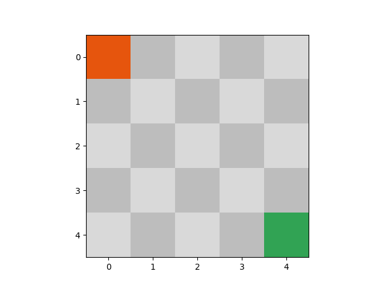
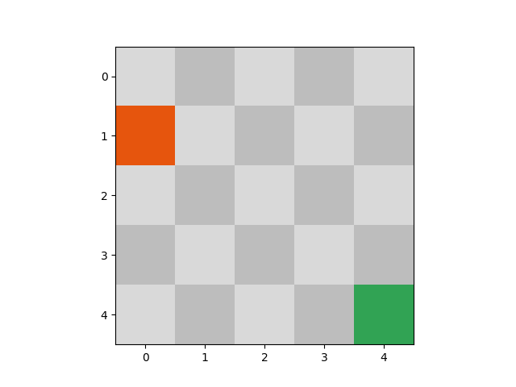

# WarGames
### An Analysis of Emergent Properties of Information Processing Systems Operating in Complex Environments
_"A strange game. The only winning move is not to play. How about a nice game of chess?."_ ~ Joshua (WarGames, 1983)

## Goal
We would like to understand how the economics of an environment influence the emergence of cooperation and conflict in multi-agent multi-goal interaction.

Why?
1) Understanding the conditions in which a system degenerates (i.e. reaches a state where it's impossible for agents to achieve the optimal outcome) allows us to optimize the processes that guide development of human systems.
2) Understanding the nature of cooperation and conflict through study of mechanical information processing systems (i.e. computers) yields insights into the beginnings of human society and builds a foundation for analysis of extraterrestrial life.

## Problem Formulation
We propose the use of reinforcement learning as a model of behavior for a rational agent operating in a partially observed environment. Note that the environment often includes other agents. We then vary the properties of the environment and agent models and study the resulting interaction through statistical simulation.

## Experiments
1) **Shoot Out** - Agent A and Agent B live in a nxn grid world with a single overlapping path to a goal state. Agent A and Agent B can either 1) stay still 2) move in any of the 4 cardinal directions or 3) _attack_ in any of the 4 cardinal directions. Only one agent can stay in the goal square. Will Agent A and Agent B learn to attack one another to maximize their individual reward?
2) **Pas de Deux** - Agent A and Agent B again live in a nxn grid world. This time a reward is only achieved if both agents occupy squares that are mirror images of each other. Over time, the reward derived from staying in a goal state decreases and a rational agent would move to another square. Will Agent A and Agent B learn to mirror each other's actions to achieve maximal reward?
3) **Prisoner's Dilemma** - Agent A and Agent B live in a simple world that simulates the conditions of [Prisoner's Dilemma](https://en.wikipedia.org/wiki/Prisoner%27s_dilemma). Will Agent A and Agent B learn to cooperate in a single iteration of Prisoner's Dilemma? What if we increase the number of iterations of Prisoner's Dilemma? What if the number of total iterations of Prisoner's Dilemma is known by the agents?
4) **One Night Werewolf** - Repeat experiment 3 but allowing each agent to signal an intent to the other agents. Each agent can choose to either lie or not to lie. How does this change the outcome of iterated Prisoner's Dilemma? What if we add a third Agent C? What if each agent has a predefined level of trustworthiness that is known by them alone and allows them to lie about their intent only a certain fraction of the time?
5) **Alien Invasion** - Agent A, Agent B, and SuperAgent C live in a nxn grid world with obstacles. The goal state for Agent A and Agent B is to 'capture' SuperAgent C. SuperAgent C has complete knowledge of the environment and the locations of Agent A and B. Will Agent A and B learn to cooperate to capture the more technologically advanced Agent C?

## Results
### Explore
##### AgentRandom

##### AgentQ

## Thought Experiments
The experiments below are only meant to think about. If reinforcement learning proves to be a reasonable model for a general information processing system that is capable of recovering the game theoretic optimal strategy, maybe someday these thought experiments could be formulated in a testable way.

1) **Neurons & Neocortex** - Simulate an artificial neuron with a simple action space: {fire, do nothing}. When a neuron fires, it changes the properties of its local environment which often includes the environment of neighboring neurons. The goal of each neuron is to use an internal representation of the local environment to optimize the system's overall capacity to predict the next input. What patterns in actuation emerge when an entire population of neurons is exposed to spatio-temporally varying input? What if the inputs are completely random? What if the inputs represent an encoding of simple patterns of beeps? What if the inputs represent an encoding of Beethoven's 5th Symphony?
2) **Religion as a Natural Phenomenon** - Are religious belief systems an emergent property of information processing systems evolving in the constraints of our physical universe and an Earth-like environment? What belief systems would emerge in [Flatland](http://www.geom.uiuc.edu/~banchoff/Flatland/)?

## Resources
[Game Theory of Mind](http://journals.plos.org/ploscompbiol/article/file?id=10.1371/journal.pcbi.1000254&type=printable)

[Game Theory Using Genetic Algorithms](https://pdfs.semanticscholar.org/3b96/427b507c429c9db96fdb3de8bc5edfe190ca.pdf)

[Understanding Agent Cooperation](https://deepmind.com/blog/understanding-agent-cooperation/)

[Homo Economicus](https://en.wikipedia.org/wiki/Homo_economicus)

[Multi-agent Reinforcement Learning in Sequential Social Dilemmas](https://storage.googleapis.com/deepmind-media/papers/multi-agent-rl-in-ssd.pdf)

[Multiagent Cooperation and Competition with Deep Reinforcement Learning](https://arxiv.org/pdf/1511.08779.pdf)

[When Machine Learning Meets AI and Game Theory](http://cs229.stanford.edu/proj2012/AgrawalJaiswal-WhenMachineLearningMeetsAIandGameTheory.pdf)

[Deep Learning for Predicting Human Strategic Behavior](http://www.cs.ubc.ca/~jasonhar/GameNet-NIPS-2016.pdf)

[A Unified Game-Theoretic Approach to Multiagent Reinforcement Learning](https://arxiv.org/pdf/1711.00832.pdf)

[Multi-Agent Cooperation and the Emergence of Natural Language](https://openreview.net/pdf?id=Hk8N3Sclg)

[Multi-Agent Reinforcement Learning Paper Collection](https://github.com/LantaoYu/MARL-Papers#learning-to-communicate)

[Flow: Architecture and Benchmarking for Reinforcement Learning in Traffic Control](https://arxiv.org/abs/1710.05465)

[Complex dynamics of elementary cellular automata emerging from chaotic rules](https://arxiv.org/abs/1203.6074)

[Modeling the Formation of Social Conventions in Multi-Agent Populations](https://arxiv.org/abs/1802.06108)

[Valuing knowledge, information and agency in Multi-agent Reinforcement Learning: a case study in smart buildings](https://arxiv.org/abs/1803.03491)

[Ingredients for Robotic Research](https://blog.openai.com/ingredients-for-robotics-research/)

[Social norm complexity and past reputations in the evolution of cooperation](https://www.nature.com/articles/nature25763)
